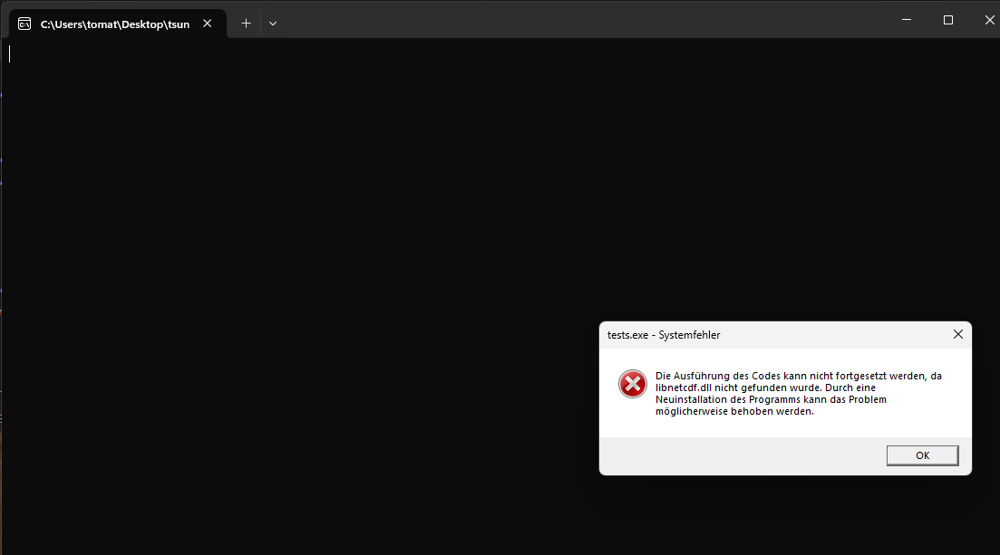
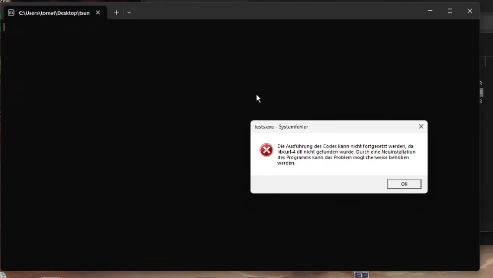
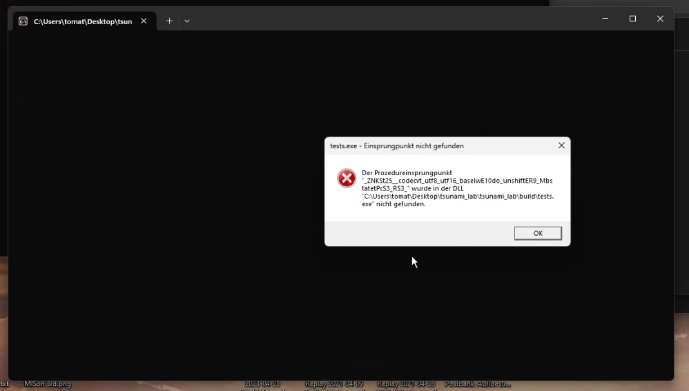
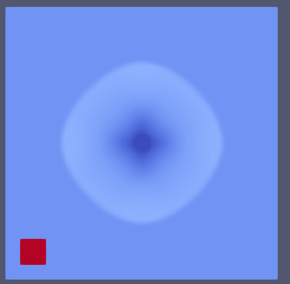
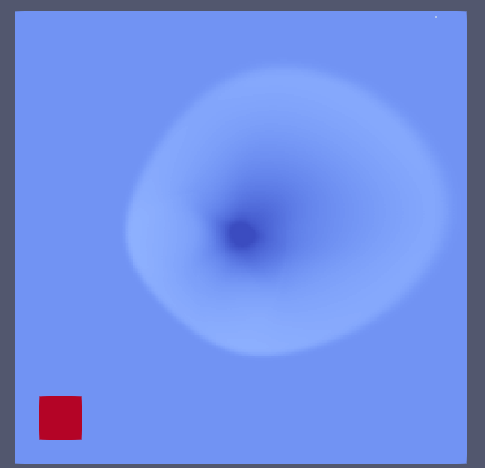
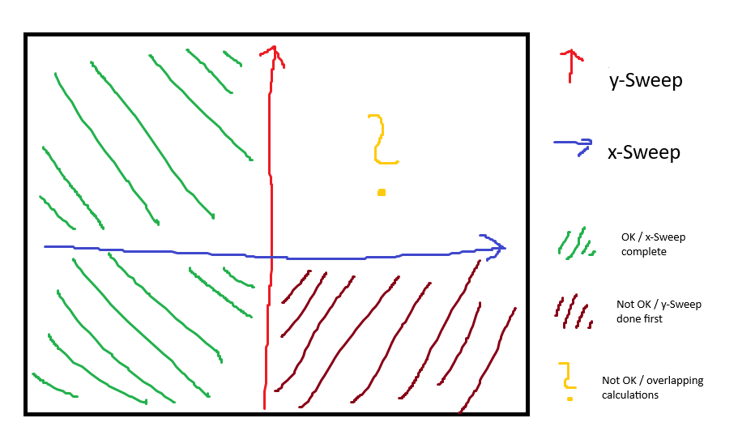

10 OpenCL
=========

Links:
------------

`Github Repo <https://github.com/MherMnatsakanyan03/tsunami_lab.git>`_

Individual Contributions:
-------------------------

Mher Mnatsakanyan and Maurice Herold did a similar amount of work.

Project Plan
------------

Goals
^^^^^

The primary goal of this project is to enhance the performance of our tsunami simulation by integrating OpenCL for GPU-acceleration. This will involve parallelizing the :code:`timeStep` function in WavePropagation2d.cpp, which currently runs only on the CPU. By leveraging the power of GPU, we expect to achieve significant performance gains.

Our private Setup consists of an Intel i5 14600KF with a Radeon Rx 6700XT. Since the Chips themselves are very powerful, we expect the memory bandwidth to be the limiting factor.

* `Intel i5 14600KF`: :math:`89.6 GB/s`
* `Radeon Rx 6700XT`: :math:`384 GB/s`

This alone is a 4.3x speedup. But considering that the CPU is also used for other tasks, such as running the operating system itself, we expect the speedup to be even higher.

On the other hand, the GPU has a much higher latency than the CPU and there will be a overhead for copying the data to the GPU.

The exact amount of improvement will depend on the size of the simulation. For smaller simulations, the overhead of copying the data to the GPU will be significant, and the speedup will be minimal. However, for larger simulations, the speedup will be much more noticeable.

To measure the performance gains, we will use tools like the Radeon GPU Profiler and Intel VTune Amplifier. These tools will allow us to measure the execution time of the :code:`timeStep` function before and after the integration of OpenCL.

Milestones & Time Schedule
^^^^^^^^^^^^^^^^^^^^^^^^^^

The project will be completed over a period of four weeks, starting from the date of this plan. Each week will be dedicated to a specific milestone, ensuring that the project stays on track and is completed within the given timeframe.

Each milestone represents a separate work package, with specific tasks to be completed within the given week. The tasks will be divided equally among the team members, ensuring that everyone contributes to the project's success.

1. **Week 1 + 2: Writing the Kernel**

* The first two weeks will be the most important. They will be dedicated to writing the OpenCL kernel
* Considering that the for-loops are completely independant, we expect that we can easily vectorize the data
* The detailed implementation will obviously depend on what we learn over the course of the project, but we think that the kernel will mainly consist of the calculations done in the FWave-solver, which will then be applied to each cell in parallel instead of sequentially going through for-loop iterations

2. **Week 3: Kernel Integration** 

* In the third week, we will integrate the newly written kernel into the existing tsunami simulation project.
* This will involve modifying the WavePropagation2d.cpp file and ensuring that the kernel is correctly utilized.
* We plan on adding a parameter that allows the user to specify whether the simulation should be run on the CPU or GPU.

3. **Week 4: Performance Testing**

* The final week will be spent testing the performance gains achieved by the GPU-acceleration. The main metric will be the final time that the simulation takes before finishing, but we also plan on using tools like the Radeon GPU Profiler to measure the execution time of the :code:`timeStep` function before and after the integration of OpenCL.

Project Report
--------------

Throughout the project, we encountered several challenges that we had to overcome.
The first issue was to undestand how to run OpenCL and try to build some small kernels
to get a feeling for the syntax. This was a huge deal since the documatation on how to
do so is very sparse and very different from different sources.

Week 1:
^^^^^^^

First we tried to compile OpenCL on Linux using WSL2, but it took some time for us to
we realized that this would not work since WSL2 does not support GPU acceleration via OpenCL.
We then switched to Windows and tried to compile OpenCL. This worked after a lot of fidling
with MSYS2 and the compiler-settings. Not-so-fun-fact: The OpenCL-headers need to be downloaded,
which is not mentioned anywhere if you are trying to look for it on AMD-documentation. Instead,
we had to rely on Nvidia-documentation to get OpenCL to compile on our AMD-GPU.

After getting OpenCL to compile, we tried to add Windows support to the project. This turned
out to be a huge waste of time, because after setting up the simulation to run on Windows and
the compiler not throwing errors, the executable was complaining about missing DLLs. We tried
tried a lot of things but ended up giving up on Windows-support, because of the following:

This is the error message we recieved when trying to execute the programm. After countless attempts
and research done, we tried to add to copy the DLL into the same folder as the executable.

Windows told us, that now a different DLL was missing. Adding this one too threw a new error
stating another DLL was missing. After adding all of the DLLs that are in the `mingw64/bin` folder,
we got the following error:

At this point we gave up on Windows-support, since we were not able to find a solution to this problem.

Week 2:
^^^^^^^

After a lot more reasearch was done, we found pocl, which allowed us to run OpenCL on the CPU. This
was great, since now we were able to run OpenCL on WSL, so the development could continue on Linux.
Fun-fact: since we assumed that OpenCL would not work on Apple-Silicon, we were pleasantly surprised
when OpenCL worked on our M2-Macbook. In fact, the integration of OpenCL was much easier on the Mac
and did not require any workarounds.

At this point we were also developing the main kernel, which we were able to test now inside the simulation.
At first we wrote a bad implementation, which was loading the data from the global memory for every
calculation. This was very slow and we were not able to get any speedup, but we were happy that at least
we made some progress.

Afterwards we tried to optimize the kernel by loading the data into the local memory. This was a huge
success for the performance, since for the first time we were able to compile faster than the CPU (on the Mac).
Our happy moment was cut short after realizing that the results were not correct. After some debugging,
we were able to get the simulation to run without throwing nans and infinities, but the results were still
bad:

|Dambreak_CPU| |Dambreak_OpenCL|

Left: CPU, Right: OpenCL

Week 3:
^^^^^^^

At this point, we were nervous that we would not be able to get the kernel to work correctly. We tried
a lot of thing, but ended up not finding the problem. Thats when Justus came in clutch and helped us.
He showed us that his implementation with CUDA did something automatically, which OpenCL did not do.
The problem was, that we had a synchronization problem. The kernel was not waiting for all threads to
finish, which lead to the x-sweep and y-sweep to be executed at the same time. This caused the issue
that the x-sweep was overwriting the results of the y-sweep. The following image illustrates the problem:

This Illustration shows, that the left side is fine because the x-Sweep is executed first and then the
y-Sweep. The right side shows the problem, where the x-Sweep is executed at the same time as the y-Sweep.
This is a problem, because each sweep needs a constant state of the simulation, since it is adding values
to the same array. If the x-Sweep is executed at the same time as the y-Sweep, the x-Sweep will write
values to the array, where the y-Sweep writes values on the same array, but in different locations,
creating an unstable state. This is why in the results of last week, the simulation has that distorted
wave at the top right corner.

To fix this, we needed to split our big WavePropagation2d-kernel into four smaller kernels.

- The first kernel sets the Ghost-cells and the boundary conditions
- The second kernel copies the data from the array to a temporary array
- The third kernel executes the x-Sweep
- The fourth kernel executes the y-Sweep

Justus helped us to split the kernel into four smaller kernels, which is why we included him
as a co-contributor in the :code:`kernel.cl` file.

Week 4:
^^^^^^^

Finally, we are in the last week. We encountereds a new issue that needed solving: The kernel
ran well on the CPU with real results, but on the GPU, the results were not correct. After some
more debugging and help from Justus, we found that the lack of an `attomic_add` function was
detremental to the results. That was not very visible in the tsunami simulation, but after
trying the dambreak-setup, we saw an inconsistent result with varying wavespeeds. This was
fixed with the addition of an `atomic_add` function, that was found on `stackoverflow <https://stackoverflow.com/a/70822133/19465205>`_.

And with that, here are our achievements from the implementation of OpenCL:

Implementation
--------------

To add OpenCL to the project, we wanted to use the interface that was already implemented in the project.
Our goal was to call the `waveprop`-constructor in the same way as the CPU-version.

That was simple, because the main part of the OpenCL-implementation was the kernel and its calling
which does not require any changes to the interface.

We first look for a platform and a device, then we create a context and a command queue.

.. code:: c++

   device = create_device();

   context = clCreateContext(NULL, 1, &device, NULL, NULL, &err);

   std::filesystem::path currentPath = std::filesystem::current_path();
   std::string kernel_path = currentPath.string() + "/src/patches/wavepropagation2d_kernel/kernel.cl";
   const char *kernel_path_char = kernel_path.c_str();

   std::cout << "Kernel path: " << kernel_path_char << std::endl;

   program = build_program(context, device, kernel_path_char);
   ksetGhostOutflowLR = clCreateKernel(program, KERNEL_GHOSTCELLS_LR, &err);
   ksetGhostOutflowTB = clCreateKernel(program, KERNEL_GHOSTCELLS_TB, &err);
   kcopy = clCreateKernel(program, KERNEL_COPY, &err);
   knetUpdatesX = clCreateKernel(program, KERNEL_X_AXIS_FUNC, &err);
   knetUpdatesY = clCreateKernel(program, KERNEL_Y_AXIS_FUNC, &err);

   queue = clCreateCommandQueue(context, device, 0, &err);

The kernel is loaded by taking the relative path of the project and then looking for the specific
path of where the kernel is located. This means that launching the executable with a global path,
i.e. "/home/user/tsunami_lab/build/tsunami_lab" will not work.

After setting the global work size, which represents the total amount of threads that will be executed
meaning the amount of cells in the simulation, we played around with the local work size. The last
implementation can be seen as a depricated code snippit in :code:`wavepropagation2d_kernel.cpp`.
The results were, that some local work sizes were faster than others and that it all was dependent
on the simulation size. We were not able to find a general rule for the local work size, which is why
we decided to use the integrated featture of OpenCL to automatically determine the local work size.
This can be achieved by setting the local work size to `NULL` in the :code:`clEnqueueNDRangeKernel` function.

The main part of the implementation lies in the `timeStep` function. The main idea was to 
vectorize the for loops of the CPU-version to allow the thousands of workers to work on the
same data at the same time.

A kernel is the set of instructions given to the GPU which tells each individual worker what to do.
Because there are steps in the simulation that are dependent on the previous step, we had to split
the kernel into five smaller kernels with 6 kernel calls per timestep:

* Setting the outflow boundary conditions for the left and right side
* Copying the data from the array to a temporary array
* Executing the x-sweep
* Setting the outflow boundary conditions for the top and bottom side
* Copying the data again to a temporary array
* Executing the y-sweep

The setting of the outflow boundary conditions was split for performance reasons. The x-sweep 
is not requiering the top and bottom boundary conditions, which is why we dont need to set
the boundary conditions for the top and bottom for the x-sweep. Vice versa for the y-sweep.

The kernel-file itself includes the five different kernels and helping functions for the kernels.
The helping functions are basically the FWave-solver, which we included in the same file for
simplicity reasons (and maybe because we did not manage to include a kernel file inside a kernel file :P).

.. code:: c

   __kernel void updateXAxisKernel(__global float *i_hTemp,
                                 __global float *i_huvTemp, __global float *i_b,
                                 ulong m_nCells_x, ulong m_nCells_y,
                                 float i_scaling, __global float *o_h,
                                 __global float *o_hu) {

      ulong x = get_global_id(0);
      ulong y = get_global_id(1);

      if (x >= m_nCells_x + 1 || y >= m_nCells_y + 2)
         return;

      ulong l_coord_L = getCoordinates(x, y, m_nCells_x, m_nCells_y);
      ulong l_coord_R = getCoordinates(x + 1, y, m_nCells_x, m_nCells_y);

      //   Define net updates array
      float l_netUpdatesL[2];
      float l_netUpdatesR[2];

      netUpdates(i_hTemp[l_coord_L], i_hTemp[l_coord_R], i_huvTemp[l_coord_L],
                  i_huvTemp[l_coord_R], i_b[l_coord_L], i_b[l_coord_R],
                  l_netUpdatesL, l_netUpdatesR);

      atomic_add_f(&o_h[l_coord_L], -i_scaling * l_netUpdatesL[0]);
      atomic_add_f(&o_hu[l_coord_L], -i_scaling * l_netUpdatesL[1]);
      atomic_add_f(&o_h[l_coord_R], -i_scaling * l_netUpdatesR[0]);
      atomic_add_f(&o_hu[l_coord_R], -i_scaling * l_netUpdatesR[1]);
   }

Benchmarking Results
--------------------

While we initially inteded to use a GPU Profilier to gain more insight into the performance of the
OpenCL-implementation, we were not able to do so. The reason for this is, that the GPU Profilier
for Nvidia (Nsight) does not support OpenCL. (You may ask yourself why we used Nsight instead of
Radeon GPU Profilier, but the answer is simple: throughout the project we switched plattforms
from AMD to Nvidia, the reason partly being the frustration with the lack of AMD-documentation
for developpers)

We tested the performance running the "tsunami2d" setup on the tohoku map with varying grid sizes
and on two vastly different devices.

* Personal Computer: Intel i5 11400KF + Nvidia RTX 4070 Super
* Macbook Air (M2)

We also implemented a feature that creates
The results were as follows:

Personal Computer
^^^^^^^^^^^^^^^^^

Parallel Writing:

.. list-table:: CPU Parallel Writing
   :widths: 25 25 25 25
   :header-rows: 1

   * - Cell Size
     - Total time
     - Calculation time
     - Write time
   * - 500
     - 
     -
     - 
   * - 1000
     - 289.32s
     - 288.50s
     - 0.00767s
   * - 2000
     - 36.35s
     - 35.62s
     - 0.00276s
   * - 4000
     - 5.07s
     - 4.35s
     - 0.00060s
   * - 8000
     - 1.46s
     - 0.74s
     - 0.00042s

.. list-table:: GPU Parallel Writing
   :widths: 25 25 25 25 15
   :header-rows: 1

   * - Cell Size
     - Total time
     - Calculation time
     - Write time
     - Boost (for Total time)
   * - 500
     - 263.43s
     - 185.70s
     - 76.53s
     -
   * - 1000
     - 34.49s
     - 24.39s
     - 8.87s
     - 8.4x
   * - 2000
     - 2.87s
     - 1.68s
     - 0.02180s
     - 12.7x
   * - 4000
     - 1.28s
     - 0.51s
     - 0.00452s
     - 3.9x
   * - 8000
     - 0.89s
     - 0.13s
     - 0.00082s
     - 1.6x

----------------------------------------------------

Serialized Writing:

.. list-table:: CPU Serialized Writing
   :widths: 25 25 25 25
   :header-rows: 1

   * - Cell Size
     - Total time
     - Calculation time
     - Write time
   * - 500
     - 
     -
     - 
   * - 1000
     - 293.89s
     - 288.24s
     - 4.83s
   * - 2000
     - 38.30s
     - 37.09s
     - 0.47s
   * - 4000
     - 7.60s
     - 6.82s
     - 0.066s
   * - 8000
     - 1.46s
     - 1.23s
     - 0.01022s

.. list-table:: GPU Serialized Writing
   :widths: 25 25 25 25 15
   :header-rows: 1

   * - Cell Size
     - Total time
     - Calculation time
     - Write time
     - Boost (for Total time)
   * - 500
     - 252.41s
     - 194.57s
     - 56.66s
     - 
   * - 1000
     - 34.25s
     - 25.70s
     - 5.43s
     - 8.6x
   * - 2000
     - 3.33s
     - 1.79s
     - 0.44s
     - 11.5x
   * - 4000
     - 1.29s
     - 0.48s
     - 0.0428s
     - 5.9x
   * - 8000
     - 0.92s
     - 0.15s
     - 0.00747s
     - 1.6x

----------------------------------------------------

No Writing:

.. list-table:: CPU No Writing
   :widths: 25 25 25
   :header-rows: 1

   * - Cell Size
     - Total time
     - Calculation time
   * - 500
     - 2231.40s
     - 2230.40s
   * - 1000
     - 266.99s
     - 266.19s
   * - 2000
     - 34.74s
     - 34.00s
   * - 4000
     - 6.86s
     - 6.14s
   * - 8000
     - 1.33s
     - 0.42s

.. list-table:: GPU No Writing
   :widths: 25 25 25 15
   :header-rows: 1

   * - Cell Size
     - Total time
     - Calculation time
     - Boost (for Total time)
   * - 500
     - 178.82s
     - 177.42s
     - 12.5x
   * - 1000
     - 25.26s
     - 24.42s
     - 10.56x
   * - 2000
     - 2.36s
     - 1.6s
     - 14.7x
   * - 4000
     - 1.08s
     - 0.33s
     - 6.35x
   * - 8000
     - 0.85s
     - 0.10s
     - 1.56x

====================================================

Macbook Air (M2)
^^^^^^^^^^^^^^^^

Parallel Writing:

.. list-table:: CPU Parallel Writing
   :widths: 25 25 25 25
   :header-rows: 1

   * - Cell Size
     - Total time
     - Calculation time
     - Write time
   * - 500
     - 
     -
     - 
   * - 1000
     - 498.21s
     - 496.60s
     - 0.00385s
   * - 2000
     - 64.72s
     - 63.96s
     - 0.00102s
   * - 4000
     - 10.00s
     - 9.29s
     - 0.00035s
   * - 8000
     - 1.99s
     - 1.27s
     - 0.00012s

.. list-table:: GPU Parallel Writing
   :widths: 25 25 25 25 15
   :header-rows: 1

   * - Cell Size
     - Total time
     - Calculation time
     - Write time
     - Boost (for Total time)
   * - 500
     - 940.45s
     - 938.21s
     - 1.07s
     -
   * - 1000
     - 140.98s
     - 139.81s
     - 0.143s
     - 3.5x
   * - 2000
     - 26.48s
     - 25.57s
     - 0.0287s
     - 2.44x
   * - 4000
     - 7.44s
     - 6.67s
     - 0.0092s
     - 1.34x
   * - 8000
     - 3.17s
     - 2.40s
     - 0.0034s
     - 0.62x

----------------------------------------------------

Serialized Writing:

.. list-table:: CPU Serialized Writing
   :widths: 25 25 25 25
   :header-rows: 1

   * - Cell Size
     - Total time
     - Calculation time
     - Write time
   * - 500
     - 
     -
     - 
   * - 1000
     - 519.84s
     - 515.04s
     - 3.14s
   * - 2000
     - 68.07s
     - 66.89s
     - 0.40642s
   * - 4000
     - 9.93s
     - 9.15s
     - 0.05405s
   * - 8000
     - 2.09s
     - 1.36s
     - 0.01041s

.. list-table:: GPU Serialized Writing
   :widths: 25 25 25 25 15
   :header-rows: 1

   * - Cell Size
     - Total time
     - Calculation time
     - Write time
     - Boost (for Total time)
   * - 500
     - 971.59s
     - 932.71s
     - 37.76s
     - 
   * - 1000
     - 141.33s
     - 136.78s
     - 0.40642s
     - 3.67x
   * - 2000
     - 26.48s
     - 25.10s
     - 0.417s
     - 2.57x
   * - 4000
     - 7.66s
     - 6.79s
     - 0.06154s
     - 1.29x
   * - 8000
     - 3.19s
     - 2.40s
     - 0.01650s
     - 0.65x

----------------------------------------------------

No Writing:

.. list-table:: CPU No Writing
   :widths: 25 25 25
   :header-rows: 1

   * - Cell Size
     - Total time
     - Calculation time
   * - 500
     - 4044.68s
     - 4043.35s
   * - 1000
     - 514.32s
     - 513.41s
   * - 2000
     - 64.47s
     - 63.61s
   * - 4000
     - 9.09s
     - 8.26s
   * - 8000
     - 2.003s
     - 1.268s

.. list-table:: GPU No Writing
   :widths: 25 25 25 15
   :header-rows: 1

   * - Cell Size
     - Total time
     - Calculation time
     - Boost (for Total time)
   * - 500
     - 915.26s
     - 914.198s
     - 4.42x
   * - 1000
     - 135.95s
     - 135.036s
     - 3.78x
   * - 2000
     - 26.36s
     - 25.58s
     - 2.45x
   * - 4000
     - 8.06s
     - 7.29s
     - 1.13x
   * - 8000
     - 3.67s
     - 2.91s
     - 0.55x

We can see a significant speedup for the GPU-implementation, especially for the larger simulations.
It is interesting to observe how differently the two devices perform. The difference in performance
gain on the Personal Computer is much larger than on the Macbook Air.

This shows us that the i5 and the 4070 Super more apart in terms of performance than the M2 and the
iGPU inside the M2.

We can also clearly see that the smaller the simulation gets, the less the GPU is able to help and
the higher the overhead becomes. This is mostly visible on the M2 which loses performance with OpenCL
on the smaller simulations.

Our initial estimate was to get a speedup of around 4-5x on the PC, which we luckily surpassed with
the average speedup being around 8x. Since we didn't look at the datasheet of the M2, we did not
have an estimate for the M2, but we are happy with the results, since we were able to get a speedup
of around 4x on the larger simulations.

We did learn that the performance is highly bottlenecked by the writing, which shows in the simulations
where the writing is turned off. This also means that if we were to write at a higher frequency, the
speedup would be exponentially lower. To fix that we would need to implement a parallel writing system,
which would be a whole project of its own.

To verify the correctness of the results, we ran the 1000-cell-size simulation on the CPU and the GPU:

.. video:: _static/content/videos/opencl/tohoku_1000_14600kf.mp4
   :width: 700
   :loop:
   :autoplay:
   :muted:

.. video:: _static/content/videos/opencl/tohoku_1000_4070s.mp4
   :width: 700
   :loop:
   :autoplay:
   :muted:

Top: 14600KF, Bottom: 4070 Super

To verify further correctness, we copied the tests for :code:`WavePropagation2d.cpp` to :code:`WavePropagation2d_kernel.cpp`
and ran the tests. The tests ran through, which means that the OpenCL-implementation is correct, assuming that the
CPU-implementation is correct.

With this we have achieved the goals of the project, which for us were:

* To learn how to run optimized code on a GPU
* To learn how to write a kernel
* To get a speedup of around 4-5x on the PC
* Dont break the simulation accuracy while doing so

We are dissapointed that we were not able to use a GPU Profilier to gain more insight into the performance of the
OpenCL-implementation, but we are happy with the results we were able to achieve.